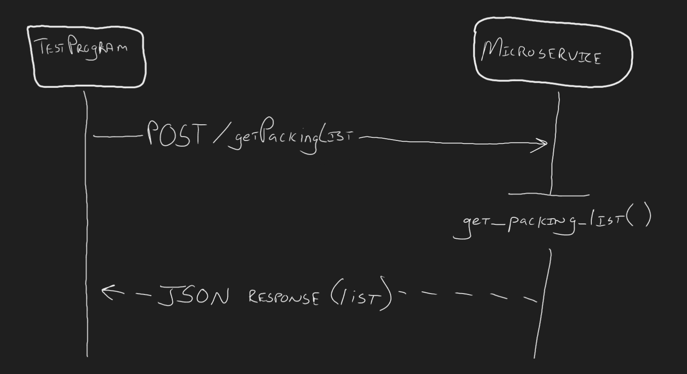

Microservice A: Packing List Generator

This Microservice provides a packing list based on a requested trip type.

How to request data:
Send a POST request to:

http://127.0.0.1:5000/getPackingList

Use this request body (JSON):

```json
{
"trip_type": "beach"
}
```

Supported trip types:
beach
business
city
camping

How to receive data:
If valid:

```json
{
  "status": "success",
  "trip_type": "beach",
  "packing_list": [
    "Swimsuit",
    "Sunscreen",
    "Sunglasses",
    "Flip Flops",
    "Beach Towel",
    "Hat",
    "Water Bottle"
  ]
}
```

If Invalid:

```json
{
  "status": "error",
  "message": "Invalid trip type. Must be one of: beach, business, city, camping."
}
```


